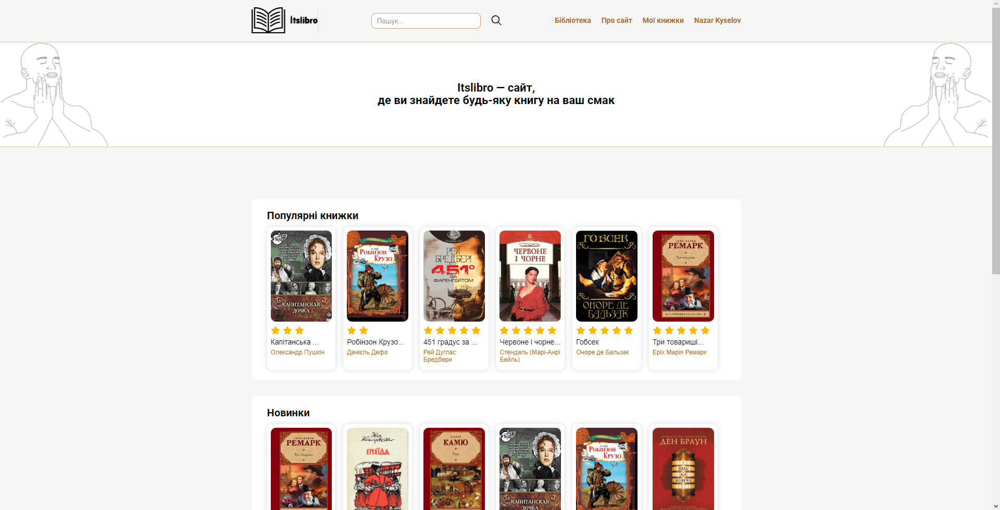

# Itslibro – Online Library | Coursework

   


## Description

Coursework was done in the final year of studying in the Dnipro Scientific Lyceum of Information Technologies (DS LIT) and my first big project. The goal was to develop a fully functional web app with PHP and MySQL, in my case, an online library.

Not only can you just read books, but also save them, add new ones, edit them, create new administrators and many other things!


## Navigation

1. [Description](#description)
1. [Installation and Running](#installation-and-running)
1. [Features](#features)
1. [Usage](#usage)
1. [Screenshots](#screenshots)
1. [Acknowledgements](#acknowledgements)


## Installation and Running

#### Install Apache and MySQL servers

1. Install [Open Server Panel](https://ospanel.io) (further OS Panel).

2. In the OS Panel go to settings/modules and set:
   1. HTTP: Apache_2.3-PHP_8.0-8.1
   1. PHP: 8.1
   1. MySQL / MariaDB: MySQL-8.0-Win10 (for Windows 10).

### Clone repository

In CMD navigate to the **OSPanel\domains\localhost** folder (the root folder is by default on C:\\) and clone the repository:

```bash
   git clone https://github.com/Abviol/itslibro.git
```

### Run the project

1. Run OS Panel.
2. In the tray click on the red flag (symbolizes unstarted OS Panel) and click "Run server".
3. Open a browser. In the search bar type "localhost/itslibro"


## Features

#### Unregistered user:
- Sorting books:
   - By newness
   - By popularity
   - By rating
   - By word capacity
- Reading books
- Registering/authorizing
- Viewing the list of books
- Searching for a book by keywords
- Reading full information about a book
#### Authorized user:
- Leaving feedback under a book (from 1 to 5)
- Saving/removing a book to/from one of the user's lists: 
   - Favourite
   - Reading
   - In plans
   - Read
   - Abandoned
- Editing a user's profile:
   - Avatar
   - Nick
   - Age
   - About me
   - Password
- Viewing information about a user's profile
#### Administrator:
- Adding books
- Editing books' information:
   - Title
   - Title in English
   - Author
   - Year written
   - Genres
   - Description
   - Age category
- Deleting books
- Viewing the data table of registered users
- Viewing the data table of books
- Adding an administrator (granting rights)
- Deleting an administrator (removing rights)


## Usage

Video showcase of usage is coming soon.


## Screenshots




## Acknowledgements

[chuchvav](https://github.com/chuchvav).